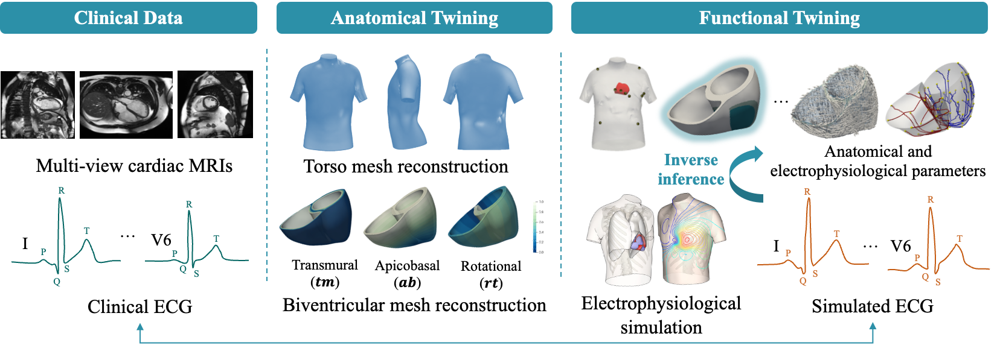

# Awesome Cardiac Digital Twins 

This is a curated repository of awesome Cardiac Digital Twin resources. Research and industry leverage cardiac digital twins to simulate and predict individualized responses to interventions, aid in diagnosis and treatment planning, optimize therapy strategies, and personalize patient care.

**Welcome to any contribute to make the resources more complehensive for beginner!**

## Contents

- [Awesome Cardiac Digital Twins ](#awesome-cardiac-digital-twins-)
  - [Contents](#contents)
  - [Definition](#definition)
  - [Research Group](#research-group)
  - [Project](#project)
  - [Company](#company)
  - [Software](#software)
  - [Tutorial](#tutorial)
  - [Blog](#blog)
  - [Public Dataset](#public-dataset)
  - [Videos/ Podcast](#videos-podcast)
  - [News](#news)
  - [Reference](#reference)

## Definition

Cardiac digital twins are personalized virtual representations combining cardiac images, ECG, and other subject-specific information [1].
CDT workflows usually involve two stages, namely anatomical and functional twinnings, as shown in Fig. 1 [2].

<figure>
  
  <figcaption>Fig. 1 The cardiac digital twin generation workflow.</figcaption>
</figure>

## Research Group

Here, we summarize the representative research teams and organizations in the computational cardiology and electrocardiography. Note that we may only list one PI name, but there may be more than one PI in a team/ lab. Furthermore, some amazing labs/ PIs have not included in this table as I did not find they have a official lab name.

| Team/ Lab                                                                    | PI                | Institute                                       |
|-------------------------------------------------------------------------------------------------|-------------------|------------------------------------------------|
| [Computational Cardiovascular Science Team](https://www.cs.ox.ac.uk/ccs/index.html)             | [Prof Blanca Rodriguez](https://scholar.google.com/citations?user=qYidL6sAAAAJ&hl=en)  | University of Oxford, UK  |
| [Computational Biology Group](https://www.cs.ox.ac.uk/compbio/)             | [Prof David Gavaghan](https://scholar.google.com/citations?user=riGX3YsAAAAJ&hl=en)  | University of Oxford, UK  |
| [Computational Cardiology Lab (CCL)](https://ccl.medunigraz.at/)                                | [Prof Gernot Plank](https://scholar.google.com/citations?user=HAYpTDYAAAAJ&hl=en)      | Medical University of Graz, Austria             |
| [Trayanova Lab](http://www.trayanovalab.org/)                                                    | [Prof Natalia Trayanova](https://scholar.google.com/citations?user=oY3ePQ8AAAAJ&hl=en) | Johns Hopkins University, US                 |
| [Yoram Rudy Lab](https://rudylab.wustl.edu/)                                        | [Prof Yoram Rudy](https://rudylab.wustl.edu/people/yoram_rudy/)            | Washington University in St. Louis, US                 |
| [Computational Electrocardiology Lab](https://cvrti.utah.edu/the-macleod-laboratory/)            | [Prof Rob MacLeod](https://scholar.google.com/citations?user=seAo310AAAAJ&hl=en)       | University of Utah, US                         |
| [Modelling and Scientific Computing Laboratory (MOX)](https://mox.polimi.it/)                    | [Prof Alfio Quarteroni](https://scholar.google.it/citations?user=U-iDlKcAAAAJ&hl=en)  | Politecnico di Milano, Italy                    |
| [Cardiac Electro-Mechanics Research Group (CEMRG)](https://www.cemrg.co.uk/)                    | [Prof Steven Niederer](https://scholar.google.com/citations?user=rtBzy78AAAAJ&hl=en)   | Imperial College London, UK                    |
| [Computational Biomedicine Lab (CBL)](https://pht180.rit.edu/cblwang/)                           | [Prof Linwei Wang](https://scholar.google.com/citations?user=CG56DzcAAAAJ&hl=en)       | Rochester Institute of Technology, US          |
| [Computational Cardiology](https://team.inria.fr/epione/en/computational-cardiology/)            | [Prof Maxime Sermesant](https://scholar.google.com/citations?user=LTDUiAkAAAAJ&hl=en)  | Inria, France                                   |
| [Computational Cardiac Modeling Group (CaMo)](https://www.ibt.kit.edu/english/camo.php)          | [Prof Axel Loewe](https://scholar.google.de/citations?user=dLThgu0AAAAJ&hl=de)        | Karlsruhe Institute of Technology, Germany      |
| [Cardiac Electrophysiology Group](https://www.auckland.ac.nz/en/abi/our-research/research-groups-themes/cardiac-electrophysiology.html) | [Prof Bruce Smaill](https://scholar.google.co.nz/citations?user=mUlyaLsAAAAJ&hl=en) | University of Auckland, New Zealand     |
| [Cardiac Computation Lab](https://cclab.med.ucla.edu/)                                           | [Prof Zhilin Qu](https://scholar.google.com/citations?user=WD2JcI4AAAAJ&hl=en)         | University of California, US                    |
| [Computational Arrhythmia Research Lab](http://web.stanford.edu/group/narayanlab/cgi-bin/wordpress/) | [Prof Sanjiv Narayan](https://scholar.google.com/citations?user=355c8nQAAAAJ&hl=en) | Stanford University, US                         |
| [Living Matter Lab](https://livingmatter.stanford.edu/)                                           | [Prof Ellen Kuhl](https://scholar.google.com/citations?hl=en&user=jjQDKYYAAAAJ&view_op=list_works&sortby=pubdate)        | Stanford University, US                         |
| [UT-Heart](http://ut-heart.com/)                                                                 | [Prof Toshiaki Hisada](https://dblp.org/pid/29/2299.html)   | University of Tokyo, Japan                      |
| [Leeds Systems Physiology Lab](http://physicsoftheheart.com/LCPL.html)                            | [Dr Michael A Colman](https://scholar.google.co.uk/citations?user=l8u7gSsAAAAJ&hl=en), [Prof Al Benson](https://scholar.google.co.uk/citations?user=XtVFdUkAAAAJ&hl=en) | University Of Leeds, UK             |
| [Cardiovascular Magnetic Resonance Group](https://cmr.ethz.ch/)                                        | [Prof Sebastian Kozerke](https://scholar.google.ch/citations?user=Y8rEIXMAAAAJ&hl=de)            | ETH Zurich, Switzerland                   |
| [Personalized Cardiac Modelling Lab](https://pcmlab.co.uk/#:~:text=%2D%20Personalised%20Cardiac%20Modelling%20Lab,treatment%20approaches%20for%20cardiac%20arrhythmias.)                                        | [Dr Caroline Roney](https://scholar.google.co.uk/citations?user=xfRxPlUAAAAJ&hl=en)            | Queen Mary University of London, UK                   |
| [Peirlinck Lab](https://peirlincklab.com/) | [Dr Mathias Peirlinck](https://scholar.google.be/citations?user=vM2KbLQAAAAJ&hl=nl)            | Delft University of Technology, Netherlands                   |
| [Digital Heart Lab](https://digitalheartlab.com/)                                        | [Dr Lei Li](https://scholar.google.com/citations?user=--CYiuwAAAAJ&hl=en)            | University of Southampton, UK                   |
| [N/A](https://person.zju.edu.cn/0003436)   | [Prof Huafeng Liu 刘华峰](https://scholar.google.com/citations?user=JbkbGvEAAAAJ&hl=en&oi=sra)            | Zhejiang University, China                   |
| [N/A](https://person.zju.edu.cn/en/lingxia) | [Prof Ling Xia 夏灵](https://www.researchgate.net/scientific-contributions/Ling-Xia-47250411)            | Zhejiang University, China                   |
| [N/A](http://faculty.dlut.edu.cn/dengdongdong/zh_CN/zhym/1071290/list/index.htm)                                       | [Prof Dongdong Deng 邓东冬](https://scholar.google.com/citations?user=dyoKMrAAAAAJ&hl=en)            | Dalian University of Technology, China                   |

## Project

- [Living Heart Project](https://www.3ds.com/products-services/simulia/solutions/life-sciences-healthcare/the-living-heart-project/): Dassault Systèmes (Steven M. Levine)
- [John’s Digital Twin](https://www.siemens-healthineers.com/perspectives/patient-twin-johns-heart): Siemens Healthineers
- [EDITH](https://www.edith-csa.eu/edith/): European Virtual Human Twin
- [Virtual Physiological Human (VPH) Projects](https://www.vph-institute.org/): Virtual Physiological Human Institute, Belgium
- [iHEART](https://iheart.polimi.it/en/home/): An Integrated Heart Model for the Simulation of the Cardiac Function
- [preDiCT](https://podcasts.ox.ac.uk/predict-cardiac-electrophysiology-modeling): A major EU-funded project to make computer models of cardiac electrophysiology for drug safety prediction.
- [EPSRC digital twins](https://www.ukri.org/what-we-do/browse-our-areas-of-investment-and-support/digital-twins-and-cyber-physical-infrastructure/).

## Company

- [Corify Care](https://corify.es/): A spain company focusing on changing the paradigm of treatment of atrial fibrillation patients by allowing personalised treatments.
- []

## Software

- [openCARP](https://opencarp.org/): an open-access cardiac electrophysiology simulator.
- [Life x](https://lifex.gitlab.io/cfd.html): an open source library for high performance finite element simulations of multiphysics, multiscale and multidomain problems.
- [Paper ECG Digitization Tool](http://ecg-digitisation.hh.med.ic.ac.uk:8050/): allow users to upload scanned ECGs to extract the digital signals (ECG pre-processing might be required) [3].
- [Chaste](https://github.com/Chaste): an open source C++ library for computational physiology and biology [4].
- [Alya](https://compbiomedeu.github.io/applications/Alya/Alya.html): a multi-scale, multi-physics cardiac simulation code.
- [ECGSIM](https://www.ecgsim.org/introduction.php): an interactive tool for studying the genesis of QRST waveforms [5].
- [MonoAlg3D_C](https://github.com/rsachetto/MonoAlg3D_C): an open-source high-performance GPU solver to numerically solve the monodomain equation.
- [Eikonal model based ECG simulator](https://github.com/juliacamps/Inference-of-healthy-ventricular-activation-properties): an open-source fast Eikonal model based simulator (check the function eikonal_ecg).
- [Reaction Eikonal model based ECG simulator](https://github.com/juliacamps/Cardiac_Personalisation): an open-source fast Reaction Eikonal model based simulator.
- [Chaste](https://chaste.github.io/): Chaste (Cancer, Heart and Soft Tissue Environment) is a general purpose simulation package aimed at multi-scale, computationally demanding problems arising in biology and physiology.
- [Cardioid](https://github.com/LLNL/cardioid): Cardioid is a cardiac multiscale simulation suite spanning from subcellular mechanisms up to simulations of organ-level clinical phenomena. The suite contains tools for simulating cardiac electrophysiology, cardiac mechanics, torso-ECGs, cardiac meshing and fiber generation tools.
- [NeuroKit](https://github.com/neuropsychology/NeuroKit/tree/master): NeuroKit2 is a user-friendly package providing easy access to advanced biosignal processing routines. Researchers and clinicians without extensive knowledge of programming or biomedical signal processing can analyze physiological data with only two lines of code.

## Tutorial

- [EP simulator](https://www.ep-simulator.com/): Basic courses of cardiac electrophysiology.
- [openCARP tutorials](https://opencarp.org/documentation/video-tutorials): Basic courses of cardiac electrophysiology.

## Blog

- [Mathematical Matters of the Heart](https://mirams.wordpress.com/): written by [Prof. Gary Mirams](https://www.maths.nottingham.ac.uk/plp/pmzgm/).

## Public Dataset

- [EDGAR database](https://www.ecg-imaging.org/edgar-database): public dataset for the application and validation of ECGI techniques.
- [MyoFit46](https://myofit46.com/): paired high-density surface ECGI and cardiac MRI.
- [UK Biobank](https://www.ukbiobank.ac.uk/): paired cine MRI and 12-lead ECG data.
- [Virtual cohort of four chamber heart from KCL](https://zenodo.org/records/3890034): 24 four-chamber hearts, built from heart failure patients.
- [MedalCare-XL](https://zenodo.org/records/8068944): 16,900 healthy and pathological synthetic 12 lead ECGs obtained via ECG simulation.
 
## Videos/ Podcast

- [Update: Now featuring a podcast – Taking a look at Digital Twin Technology: a new frontier in personalised healthcare](https://www.myesr.org/ai-blog/taking-a-look-at-digital-twin-technology-a-new-frontier-in-personalised-healthcare/).
- [Digital twin heart – Computer model for an optimized therapy success](https://www.youtube.com/watch?v=skr_cjJJFrc).
- [Your Personal Virtual Heart | Natalia Trayanova | TEDxJHU](https://www.youtube.com/watch?v=wSDMPxGGy3A&t=618s).
- [Heart research, AI and digital twins](https://www.youtube.com/watch?v=jZz9TfvRHs4).
- [Personalized Cardiology Powered by AI and Computational Modeling - Prof Natalia Trayanova (JHU)](https://www.youtube.com/watch?v=kcwMSqtFPOQ&t=2381s)
- [A mathematical microscope for non-invasive heart diagnostics](https://www.youtube.com/watch?v=ehL-YDc6-5w)

## News

- 31 Mar, 2023: [Virtual You: how digital twins will transform medicine](https://blog.sciencemuseum.org.uk/virtual-you-how-digital-twins-will-transform-medicine/)
- 4 Feb, 2019: [FDA approved clinical trial for the utility of computer simulations driving atrial ablation procedure](https://heartadvance.jhu.edu/2019/02/04/fda-approves-dr-trayanovas-application-for-atrial-ablation-clinical-trial/)
- 17 Sep, 2015: [Personalized heart models for surgical planning](https://news.mit.edu/2015/3-d-printed-heart-models-surgery-0917)

## Reference

[1]: Corral-Acero, Jorge, et al. "The ‘Digital Twin’to enable the vision of precision cardiology." European heart journal 41.48 (2020): 4556-4564. [link](https://academic.oup.com/eurheartj/article/41/48/4556/5775673)

[2]: Li, Lei, et al. "Towards Enabling Cardiac Digital Twins of Myocardial Infarction Using Deep Computational Models for Inverse Inference." IEEE Transactions on Medical Imaging (2024). [link](https://ieeexplore.ieee.org/abstract/document/10440104)

[3]: Wu, Huiyi, et al. "A fully-automated paper ECG digitisation algorithm using deep learning." Scientific Reports 12.1 (2022): 20963. [link](https://www.ncbi.nlm.nih.gov/pmc/articles/PMC9722713/)

[4]: Mirams, Gary R., et al. "Chaste: an open source C++ library for computational physiology and biology." PLoS computational biology 9.3 (2013): e1002970. [link](https://journals.plos.org/ploscompbiol/article?id=10.1371/journal.pcbi.1002970)

[5]: Van Oosterom, Allan, and T. F. Oostendorp. "ECGSIM: an interactive tool for studying the genesis of QRST waveforms." Heart 90.2 (2004): 165-168. [link](https://heart.bmj.com/content/90/2/165.short)